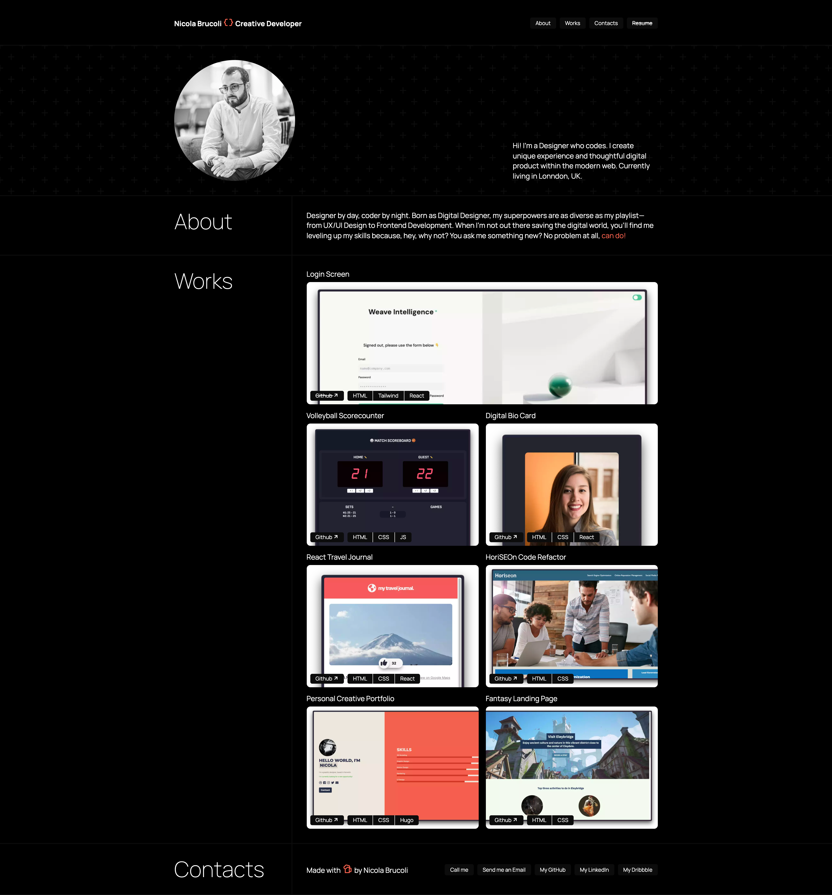

# nicola-brucoli-portfolio
Live Website hosted on Github Pages: https://sonictrain.github.io/nicola-brucoli-portfolio/

## Table of Contents 
- [Preview](#preview)
- [Description](#description)
- [Features](#features)
- [Wireframe](#wireframe)
- [Usage](#usage)
- [Credits](#credits)
- [License](#license)

## Preview


## Description
Welcome to my portfolio repository! This GitHub project houses the code for my professional portfolio website, built exclusively with HTML and CSS. The site showcases my skills, projects, and experiences through clean and semantic code. Explore the sections on projects, skills, and a brief about me. Your feedback is valuable as I continuously refine and expand my online presence. Thanks for visiting!

## Features
* When the page is loaded it presents my name, a recent photo , and links to sections about me, my work, and a form to contact me.
* When one of the links in the navigation is clicked then the UI scrolls to the corresponding section.
* When viewing the section about my work, it contains titled images of my applications.
* When presented with the your first application, its image is larger in size than the others.
* When images of the applications are clicked, the user is taken to that deployed application or Git repository.
* When the page is resized or viewed on various screens and devices, the layout is responsive and adapts to the given viewport.
### Sticky blurred header


### Label hovering


## Wireframe
The wireframe of the project is available on Figma and it is currently a WIP. Link to the [Figma](https://www.figma.com/file/gNEyuhbyu4AU5vJ0tF7DUv/Personal-Portfolio?type=design&node-id=0%3A1&mode=design&t=hVB7J0tNl7wv2vJS-1).

## Usage
Simply clone the repo using the following command:
```
git clone <repository-address>
```

cd inside the the repository on your local machine:
```
cd nicola-brucoli-portfolio
```

and finally launch the `index.html` file with a browser of your choice.
Feel free to visit the website from [this link](https://sonictrain.github.io/nicola-brucoli-portfolio/).

## License
Copyright (c) Nicola Brucoli. All rights reserved.
Licensed under the [MIT](./LICENSE) license.